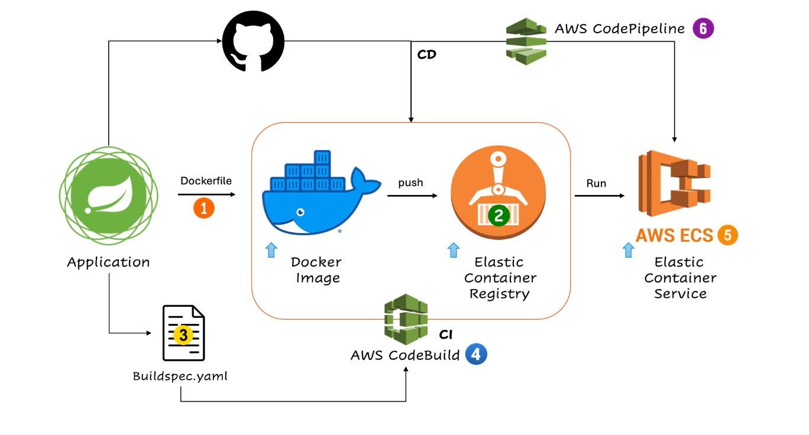

# Containerized Microservices with ECS Fargate 

## Objective
To design, deploy, and manage a containerized microservices architecture using AWS services, specifically AWS ECS Fargate or EKS (Elastic Kubernetes Service). The goal is to create a robust, scalable, and secure infrastructure to run microservices in the cloud using Docker containers. The project will include the following:
- **Containerization of Microservices** using Docker
- **Deployment using ECS Fargate** 
- **CI/CD pipeline for continuous delivery and management** of microservices
- **Monitoring and Logging** for performance insights

## Services used
- **Amazon ECS Fargate**) for container orchestration
- **Amazon RDS** (Relational Database Service) for database storage
- **AWS Application Load Balancer** (ALB) for routing traffic to microservices
- **Amazon VPC** (Virtual Private Cloud) for networking and security
- **AWS CloudWatch** for monitoring and logging
- **Docker** for containerizing microservices
- **Amazon ECR** (Elastic Container Registry) for storing Docker images
- **AWS CodePipeline** for CI/CD automation

### Architecture

#### Implementation guide
[📘 Download Deployment_ECS_Fargate.docx](Deployment_ECS_Fargate.docx)

*Note: This file is large and cannot be previewed on GitHub but can be downloaded by clicking the link.*
